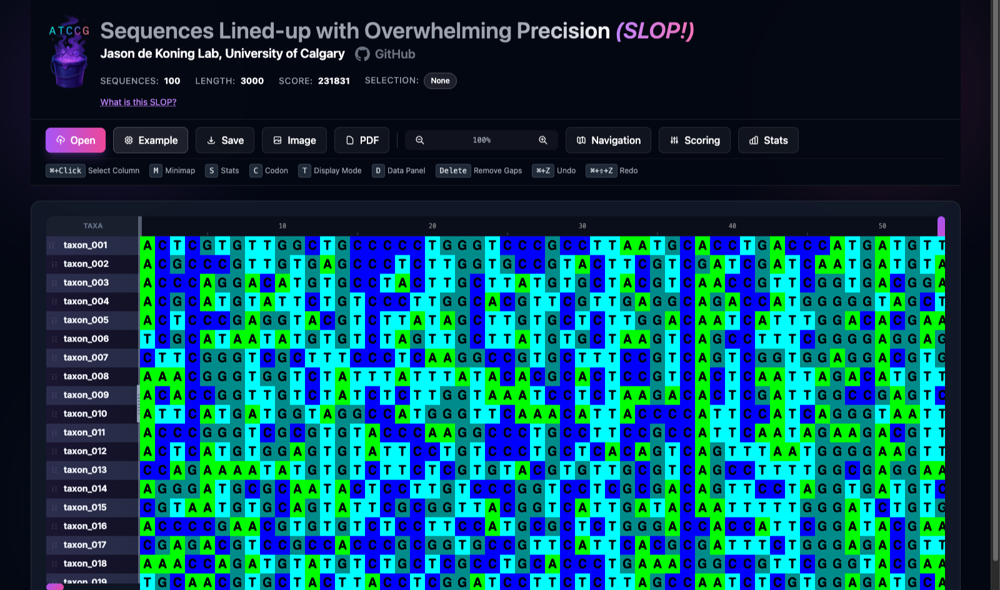

<div align="center">


# SLOP

**S**equences **L**ined-up with **O**verwhelming **P**recision

A GPU-accelerated multiple sequence alignment viewer and editor that runs entirely in your browser.

[**▶ Try it live**](https://dekoning-lab.github.io/SLOP/) · [de Koning Lab](https://lab.jasondk.io), University of Calgary

</div>

---

SLOP pairs a WebGL front end with a WebAssembly (C++) engine, so editing stays smooth on alignments that bring conventional viewers to a crawl — hundreds of taxa by tens of thousands of columns, at interactive frame rates. Everything runs client-side: no server, no upload, no install. Your sequences never leave your machine.

> **Origin.** SLOP is an educational project. It began as a classroom exercise for **MDSC 308** at the University of Calgary in the fall of 2025, and grew from there.



## Features

- **A viewport built for scale.** Virtual scrolling, GPU-instanced text rendering, viewport culling, and sticky rulers keep large alignments responsive.
- **Mode-aware rendering.** Switch instantly between nucleotide, codon, and translated amino-acid views. Codon mode applies amino-acid palettes per triplet, amino mode collapses columns without blank spacers, and nucleotide mode uses classic colours. Multiple genetic codes are supported.
- **Precise editing.** Drag-to-gap, ⌘/Ctrl-click column selection, sequence reordering, gap removal, and undo/redo — all backed by the WebAssembly engine for deterministic behaviour.
- **Vector PDF export.** Generates true vector PDFs that mirror the on-screen mode, colour scheme, and genetic code, with multi-block page layouts, `page/total` headers, and a "fit to pages" workflow that warns before it would compromise readability.
- **Image export and minimap.** Export the viewport as an image, and navigate long alignments with a live minimap preview.

## Running it

Open the [hosted version](https://dekoning-lab.github.io/SLOP/), or run it locally. SLOP uses ES modules, so it needs a real HTTP server — opening `index.html` over `file://` will not work.

```bash
git clone https://github.com/dekoning-lab/SLOP.git
cd SLOP
python3 -m http.server 8000
```

Then visit <http://localhost:8000/>.

Load a FASTA or PHYLIP file with **Open**, try `examples/example_codon.fasta`, or hit **Example** to generate a 100 × 3000 test alignment.

## Keyboard shortcuts

| Key | Action | | Key | Action |
|---|---|---|---|---|
| `⌘`/`Ctrl` + click | Select column | | `⌘`/`Ctrl` + `O` | Open file |
| `M` | Toggle minimap | | `⌘`/`Ctrl` + `S` | Save alignment |
| `S` | Toggle stats panel | | `⌘`/`Ctrl` + `A` | Select all |
| `C` | Toggle codon mode | | `⌘`/`Ctrl` + `F` | Find |
| `T` | Cycle display mode | | `⌘`/`Ctrl` + `Z` | Undo |
| `D` | Toggle data panel | | `⌘`/`Ctrl` + `⇧` + `Z` | Redo |
| `G` | Go to position | | `Delete` | Remove gaps |

## How it fits together

| Path | Role |
|---|---|
| `index.html` | The application: UI, interaction wiring, export dialogs |
| `slop.css` | Prebuilt Tailwind stylesheet — regenerate with `./build_css.sh` |
| `webgl/` | Renderer — WebGL viewport, texture atlas, and the engine adapter |
| `exporters/` | Image export |
| `msa_engine_optimized.cpp` | Core engine: parsing, editing, selection, stats, scoring |
| `alignment_pdf.cpp`, `font_manager.cpp`, `pdfgen.c` | PDF layout, scaling heuristics, font embedding |
| `msa_engine_opt.js`, `msa_engine_opt.wasm` | Prebuilt WebAssembly engine (committed, so no build step is needed) |
| `assets/` | JetBrains Mono, embedded into exported PDFs |

## Rebuilding

Both build products are committed, so neither step is needed to run SLOP.

**The WebAssembly engine** — only if you change the C/C++ sources. Requires the [Emscripten SDK](https://emscripten.org/docs/getting_started/downloads.html):

```bash
source /path/to/emsdk/emsdk_env.sh
./build_wasm.sh
```

Then bump `ENGINE_VERSION` in `index.html` (and the matching `?v=` on the engine `<script>` tag) so browsers pick up the new binary — the engine is cached aggressively on purpose.

**The stylesheet** — only if you add or change a Tailwind class in `index.html`:

```bash
./build_css.sh
```

Verbose logging is off by default in both layers. For the renderer, set `window.SLOP_DEBUG = true` in the console before loading the page. For the engine, rebuild with tracing compiled in:

```bash
EMCC_EXTRA_FLAGS=-DSLOP_DEBUG ./build_wasm.sh
```

## Known limitations

- In translated amino-acid view, ⌘/Ctrl-click selection does not work on column 0.
- Range-based PDF export (selection-only or current-view) is currently disabled pending a rewrite on top of the current page estimator.

## Requirements

A browser with WebGL 2 and WebAssembly — current Chrome, Firefox, Safari, and Edge all qualify.

## License

MIT — see [LICENSE](LICENSE). Bundled JetBrains Mono is under the SIL Open Font License; bundled PDFGen is public domain.
